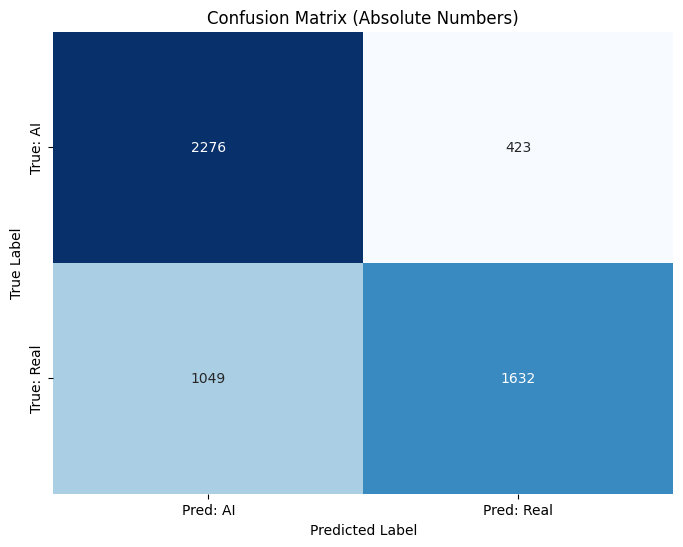
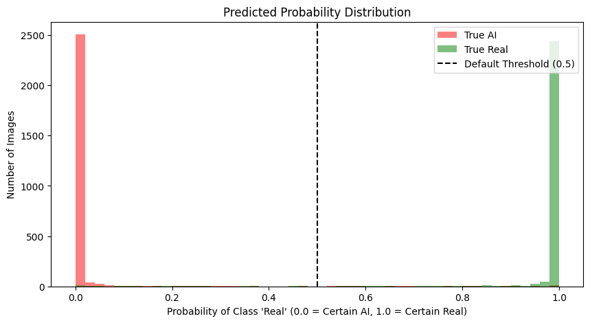

# GenCheckAiModel 

[ Русский](#русский) | [English](#english)

[Telegram Bot](https://github.com/dimong4/GenCheckAiBot) | [Kaggle](https://www.kaggle.com/models/dimong4/gencheckai/)

---

## English

*This project was developed using images generated by the Yandex Art model in the Shedevrum application. The images are provided solely for the research purposes of this Yandex Lyceum graduate project and are not intended for public use.*

**Stack:** Python, PyTorch, Transformers (Hugging Face), CatBoost, Scikit-learn, Matplotlib.

# Data Used
An aggregated dataset of **104,700 images** was formed.
*   **Real Data:** Photos from the [ImageNet](https://www.image-net.org/) benchmark.
*   **Russian AI (Custom):** Images generated specifically for the project using **Kandinsky** and **YandexART**. A custom prompt generator based on ImageNet classes was developed, with descriptions adapted (translated) into Russian.
*   **International AI (GenImage):** Datasets from the [GenImage](https://github.com/GenImage-Dataset/GenImage) benchmark (Midjourney, Stable Diffusion, BigGAN, VQBM, Wukong, ADM, Glide).

# Research: Model Evolution

## 1. From Classical CNNs to Vision Transformers
The initially tested **ResNet-50** architecture showed high accuracy on familiar data but lacked generalization ability. To improve analysis, I added the **Swin Transformer (Swin-T)**.
*   **Result:** Due to its hierarchical structure and analysis of global pixel relationships, the transformer is better at detecting compositional and geometric AI errors that standard convolutional networks often miss.

## 2. Transition to Metric Learning
To make the system robust against new versions of generators, I implemented **Contrastive Learning**.
*   **Goal:** To train the neural network to build a feature space where the "signature" of real photos is in one dense cluster and generations are in another, regardless of the specific model.
*   **Implementation:** Used **Triplet Margin Loss** and the **Triplet Margin Miner** algorithm. The model learns to capture the data structure itself (noise, specific rendering artifacts), creating a reliable 128-dimensional embedding.

## 3. Zero-shot CLIP
The hypothesis of using the **CLIP** model in its pure form for detection via text triggers (comparing proximity to the concepts of "photo" vs "ai generated") was tested.
*   **Result:** Accuracy was only **~73%**. CLIP often fails on high-quality studio photos, mistaking them for AI due to "perfect" lighting.
*   **Solution:** CLIP became a vital part of the ensemble.

# Final Result: Feature Fusion + CatBoost
The final solution combines features from three independent extractors (ResNet-Metric, Swin-T, CLIP). They are concatenated into a single **high-dimensional vector**.

This vector analyzes the image at three levels:
1.  **Pixel level** (local artifacts);
2.  **Structural level** (geometry and global context);
3.  **Logical level** (semantic correctness).

**CatBoost** was chosen for the final classification, as it finds non-linear dependencies in combined features more efficiently than neural networks.

**Ensemble Metrics:**
*   Accuracy — **0.98**
*   Weighted F1-Score — **0.9758**
*   ROC-AUC — **0.9973**

---

## Русский

*Проект подготовлен с использованием изображений, сгенерированных моделью Yandex Art в приложении Шедеврум. Изображения предоставлены исключительно для исследовательских целей данного проекта выпускнику Яндекс Лицея и не предназначены для публичного использования.*

**Стек:** Python, PyTorch, Transformers (Hugging Face), CatBoost, Scikit-learn, Matplotlib.

# Использованные данные 
Сформирован агрегированный датасет объемом **104 700 изображений**.
*   **Реальные данные:** Фотографии из бенчмарка [ImageNet](https://www.image-net.org/).
*   **Российский ИИ (Custom):** Изображения, сгенерированные специально для проекта через модели **Kandinsky** и **YandexART**. Для них был разработан собственный генератор промптов на базе классов ImageNet и выполнена адаптация (перевод) описаний на русский язык.
*   **Зарубежный ИИ (GenImage):** Готовые наборы данных из бенчмарка [GenImage](https://github.com/GenImage-Dataset/GenImage) (Midjourney, Stable Diffusion, BigGAN, VQBM, Wukong, ADM, Glide).

# Исследовательская часть: эволюция модели

## 1. От классических CNN к Vision Transformers
Изначально протестированная архитектура **ResNet-50** показала высокую точность на знакомых данных, но недостаточную обобщающую способность. Для улучшения анализа я добавил **Swin Transformer (Swin-T)**.
*   **Результат:** За счет иерархической структуры и анализа глобальных связей в пикселях, трансформер лучше выявляет композиционные и геометрические ошибки ИИ, которые «пропускают» обычные сверточные сети.

## 2. Переход к метрическому обучению (Metric Learning)
Чтобы сделать систему устойчивой к новым версиям генераторов, я реализовал переход к **Contrastive Learning**.
*   **Цель:** Обучить нейросеть выстраивать пространство признаков так, чтобы «почерк» реальных фото находился в одном плотном кластере, а генераций — в другом, независимо от конкретной модели.
*   **Реализация:** Использована функция потерь **Triplet Margin Loss** и алгоритм **Triplet Margin Miner**. Модель обучается фиксировать саму структуру данных (шумы, специфические искажения рендеринга), создавая надежный 128-мерный эмбеддинг.

## 3. Zero-shot CLIP
Была проверена гипотеза использования модели **CLIP** в чистом виде для детекции через текстовые триггеры (сравнение близости к понятиям "photo" и "ai generated").
*   **Результат:** Точность составила всего **~73%**. CLIP часто ошибается на качественных студийных фото, принимая их за ИИ из-за идеального освещения.
*   **Решение:** CLIP стал важной частью ансамбля.

# Финальный результат: Feature Fusion + CatBoost
Итоговое решение объединяет признаки от трех независимых экстракторов (ResNet-Metric, Swin-T, CLIP). Они конкатенируются в один **общий вектор высокой размерности**. 

Этот вектор учитывает изображение на трех уровнях:
1.  **Пиксельный** (локальные артефакты);
2.  **Структурный** (геометрия и глобальный контекст);
3.  **Логический** (семантическая корректность).

Для финальной классификации выбран **CatBoost**, который эффективнее нейросетей находит нелинейные зависимости в объединенных признаках.

**Метрики ансамбля:**
*   Accuracy — **0.98**
*   Weighted F1-Score — **0.9758**
*   ROC-AUC — **0.9973**

