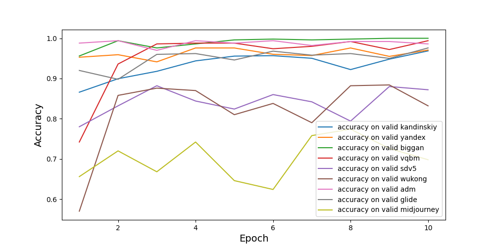
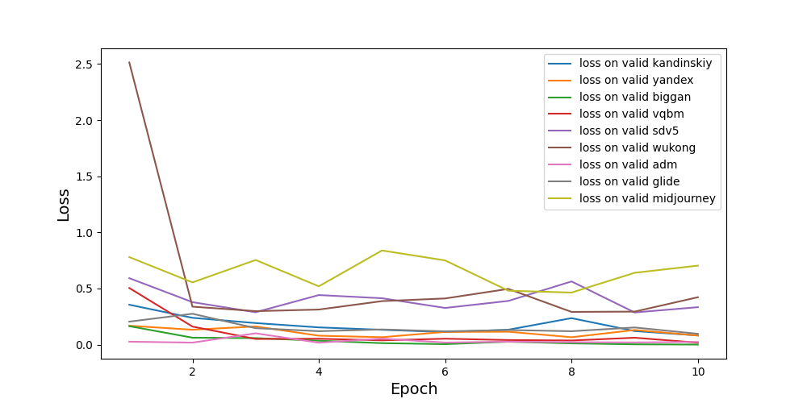
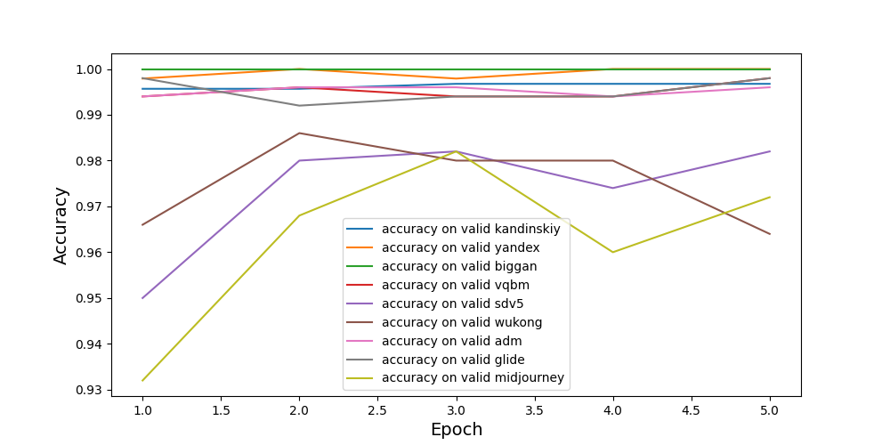

# GenCheckAiModel
ML часть проекта на "Большие вызовы"

[Демо проекта(репозиторий)](https://github.com/dima0409/GenCheckAIBot)

Проект подготовлен с использованием изображений, сгенерированных моделью Yandex Art в приложении Шедеврум.  
Изображения предоставлены исключительно для исследовательских целей данного проекта выпускнику Яндекс Лицея и не предназначены для публичного использования
## Технологии 
- PyTorch
- Matplotlib

## Необходимое ПО
[Python 3.12](https://www.python.org/downloads)


## О моделях и точности
В проекте для классификации изображений использовались модели на основе архитектур ResNet50 и Swin Transformer (Swin-T).

### Графики ResNet50



### Графики Swin-T



## Установка

1. Склонируйте репозиторий
```bash
git clone https://github.com/dima0409/GenCheckAiModel.git
cd GenCheckAiModel
```

2. Создайте виртуальное окружение и активируйте его
```bash
python3 -m venv venv
```
Активация на windows:
```bash
.\venv\bin\activate
```
Активация на linux:
```bash
source venv/bin/activate
```

3. Установите записимость
```bash
pip install -r requirements.txt
```

## Генерация промтов

В файле `promt.py` можно настроить количество промтов на категорию
`for j in range(n)`, где n - количество

Итоговые промты будут записаны в `out.txt`

## Генерация изображений
Открой файл `template.env`, поменяйте значения переменных среды и выполите следующую команду:

Для windows
```bash
copy template.env .env
```
Для linux
```bash
cp template.env .env
```

## Запуск ML модели
Для запуска требуется:
```bash
cd GenCheckAiModel
jupyter lab
```

Юпитер хаб будет доступен по ссылке - `http://localhost:8888`
